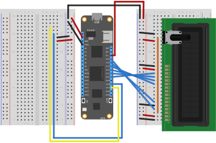

# TemperatureMonitor2

This sample demonstrates using a BME280 with a 4x20 LCD to display the temperature, humidity, and pressure.



Example LCD display

```text
Conditions
Temp: 25.5 C 78.0 F
Press: 101394.3 Pa
Humidity: 51.0%
```
